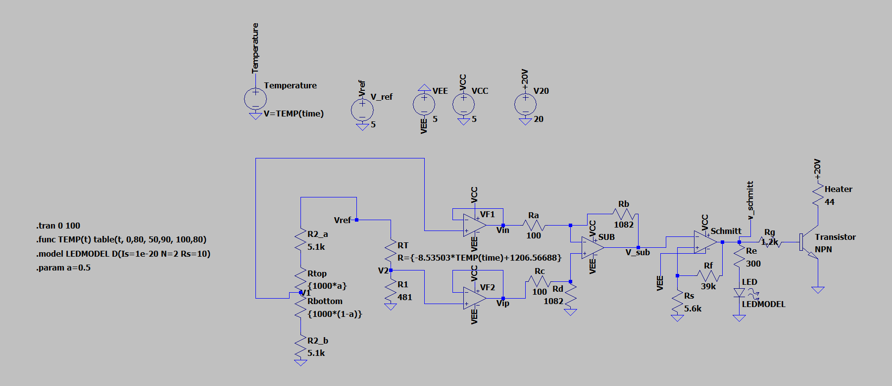
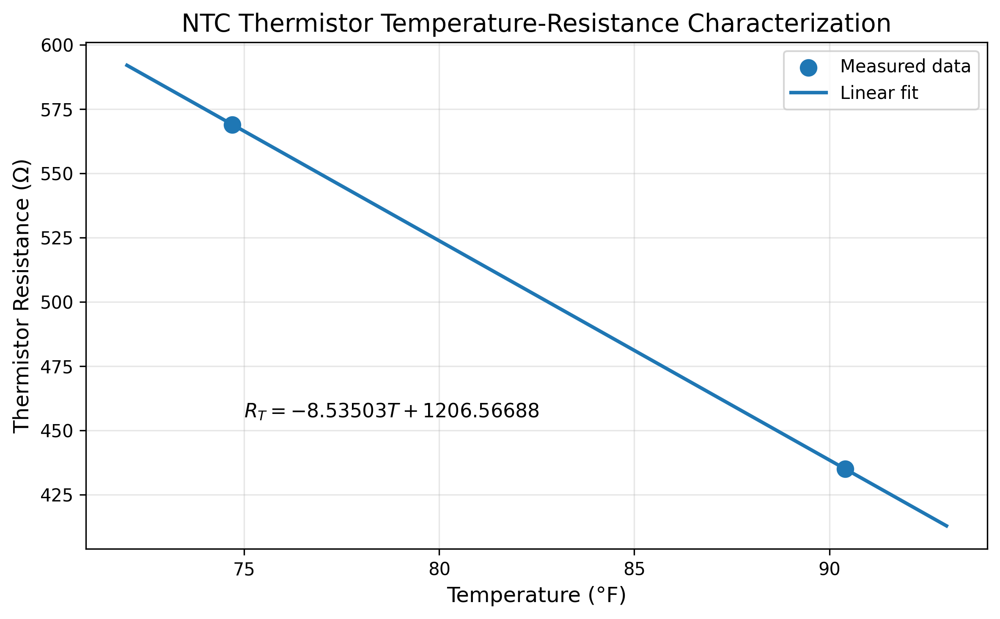
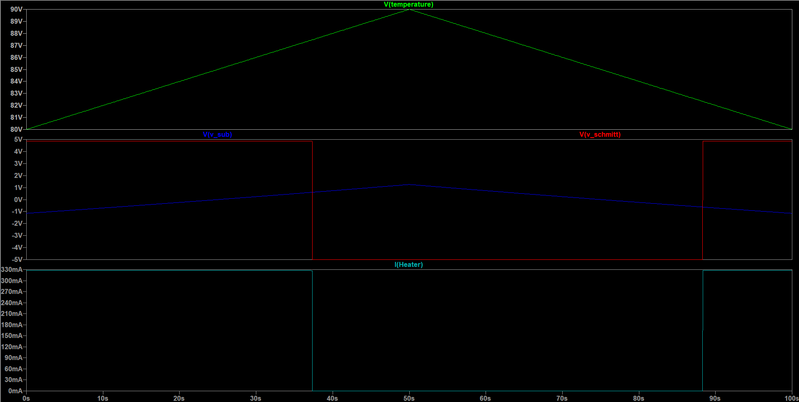
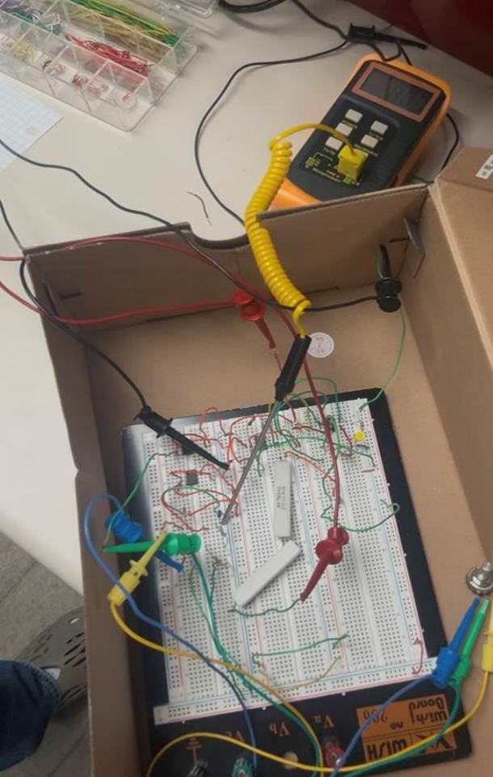

# Analog Temperature Controller with Hysteresis

Built, simulated, and tested an analog closed-loop temperature controller using a thermistor, op-amp signal conditioning, a Schmitt trigger, an NPN transistor, and resistive heating elements.

## Project Overview

The goal of this project was to maintain temperature within a defined range using analog feedback and hysteresis.

The control chain is:

**Temperature → Thermistor → Voltage Divider → Voltage Buffers → Differential Amplifier → Schmitt Trigger → BJT Switch → Heater**

## Circuit Schematic

The complete system combines sensing, signal conditioning, hysteresis, and power switching in one analog control loop.

## Key Features

- NTC thermistor temperature sensing
- Differential signal conditioning
- Schmitt-trigger hysteresis
- NPN low-side heater switching
- Resistive heater load
- LTspice transient simulation
- Physical prototype validation
- Simulation-to-hardware comparison

## 1. Thermistor Characterization

The thermistor was experimentally characterized by measuring resistance at different temperatures.

Measured data:

- 74.7°F → 569 Ω
- 90.4°F → 435 Ω

A linear approximation was used over the operating range:

\[
R_T = -8.53503T + 1206.56688
\]

The negative slope confirms the thermistor's NTC behavior: resistance decreases as temperature increases.

## 2. Design Targets

The controller was designed around a temperature band of approximately:

- **Heater ON:** 83°F
- **Heater OFF:** 87°F

Using the thermistor model:

\[
R_T(83^\circ F) \approx 498.16\Omega
\]

\[
R_T(87^\circ F) \approx 464.02\Omega
\]

The temperature-sensitive voltage divider therefore produces approximately:

\[
V_2(83^\circ F) \approx 2.456V
\]

\[
V_2(87^\circ F) \approx 2.544V
\]

## 3. Signal Conditioning

Because the sensor voltage only changes by approximately:

\[
\Delta V_2 \approx 88mV
\]

between the design temperatures, a differential amplifier is used to amplify the difference between the thermistor signal and the reference voltage.

The differential stage uses:

- \(R_a = 100\Omega\)
- \(R_b = 1082\Omega\)

giving approximately:

\[
A_v = \frac{R_b}{R_a}
\]

\[
A_v \approx 10.82
\]

Voltage followers are used ahead of the differential stage to buffer the thermistor and reference networks.

## 4. Schmitt Trigger and Hysteresis

The Schmitt trigger introduces two switching thresholds instead of a single switching point.

Measured physical thresholds were approximately:

\[
V_{UT} = +0.5369V
\]

\[
V_{LT} = -0.431V
\]

This hysteresis prevents rapid switching when the measured temperature is close to the desired operating point.

The resulting behavior is:

**Low temperature → Schmitt output HIGH → transistor ON → heater ON**

**High temperature → Schmitt output LOW → transistor OFF → heater OFF**

## 5. LTspice Simulation

The full circuit was recreated in LTspice.

A continuous transient simulation varied the modeled thermistor temperature from:

\[
80^\circ F \rightarrow 90^\circ F \rightarrow 80^\circ F
\]

This allowed the Schmitt trigger to retain state and demonstrate true hysteresis.

The simulation showed:

- heater ON at low temperature
- switching OFF after crossing the upper threshold
- heater remaining OFF during initial cooling
- switching back ON only after crossing the lower threshold

The LTspice schematic file is available in:

[`ltspice/hysteresis_temperature_controller.asc`](ltspice/hysteresis_temperature_controller.asc)

## 6. Physical Prototype

The circuit was also constructed and tested on a breadboard.

The measured hardware switching temperatures were:

- **Heater OFF:** approximately 88.7°F
- **Heater ON:** approximately 86.7°F

## 7. Simulation vs Hardware

The simulation and physical circuit show the same fundamental hysteresis behavior, but the exact switching points differ.

One important source of difference is op-amp saturation.

The physical circuit measured approximately:

\[
+V_{sat} = 4.330V
\]

\[
-V_{sat} = -3.480V
\]

while the generic LTspice op-amp model saturates much closer to the ±5 V supply rails.

Because the Schmitt-trigger thresholds depend on output saturation voltage, this shifts the simulated switching temperatures.

Other sources of deviation include:

- component tolerances
- simplified linear thermistor modeling
- transistor nonidealities
- thermal lag
- limited thermistor calibration data

This comparison highlights the difference between idealized circuit simulation and real hardware behavior.

## Tools and Concepts

- LTspice
- Operational Amplifiers
- NTC Thermistors
- Differential Amplifiers
- Schmitt Triggers
- Positive Feedback
- Hysteresis
- BJT Switching
- Analog Feedback
- Circuit Analysis
- Breadboard Prototyping
